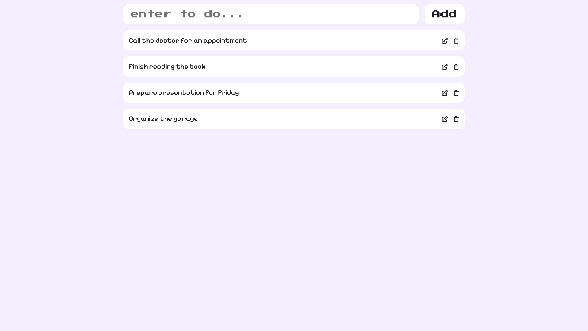

# CRUD To-Do React App



## Overview

This is a plain and simple To-Do application built using React and Vite. The app allows users to perform all basic CRUD (Create, Read, Update, Delete) operations on their to-do items. It uses the browser's local storage to persist data, ensuring that the user's to-dos are saved even after refreshing the page or closing the browser.

## Installation and Setup

To run this application locally, follow these steps:

#### 1. Clone the Repository:
```
git clone https://github.com/maithilisd/react-todo.git
cd todo-app
```

#### 2. Install Dependencies:
```
npm install
```

#### 3. Run the Development Server:
```
npm run dev
```

#### 4. Open the Application:
Open your browser and navigate to [http://localhost:5173](http://localhost:5173/) to see the application in action.
